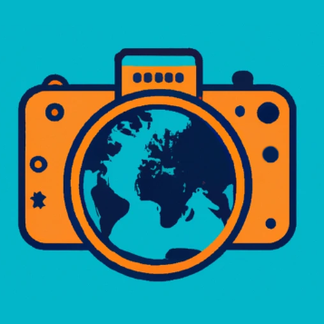
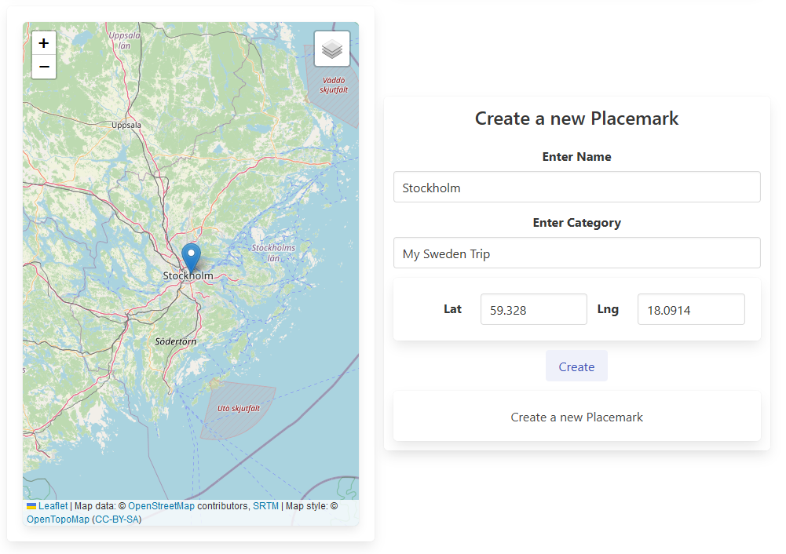
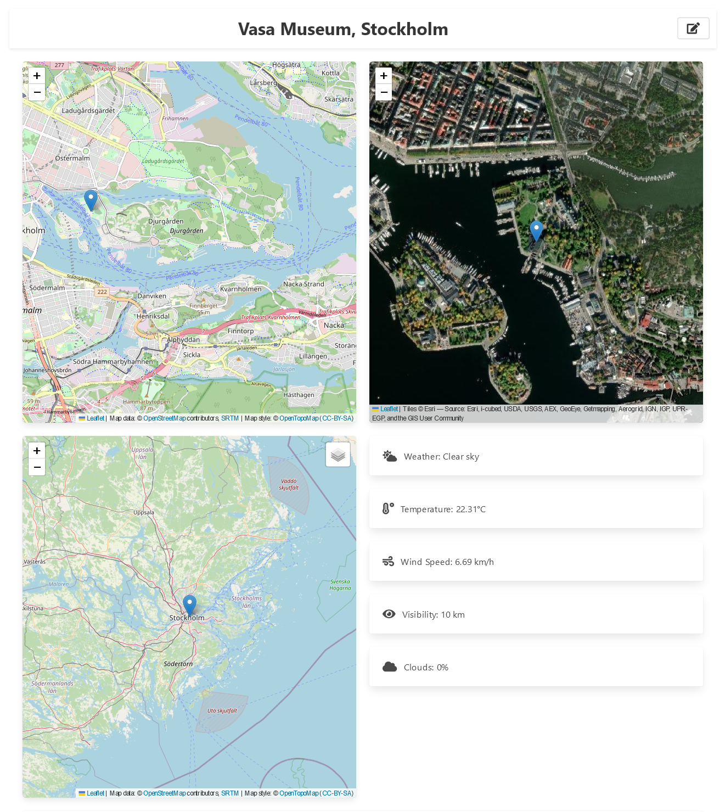
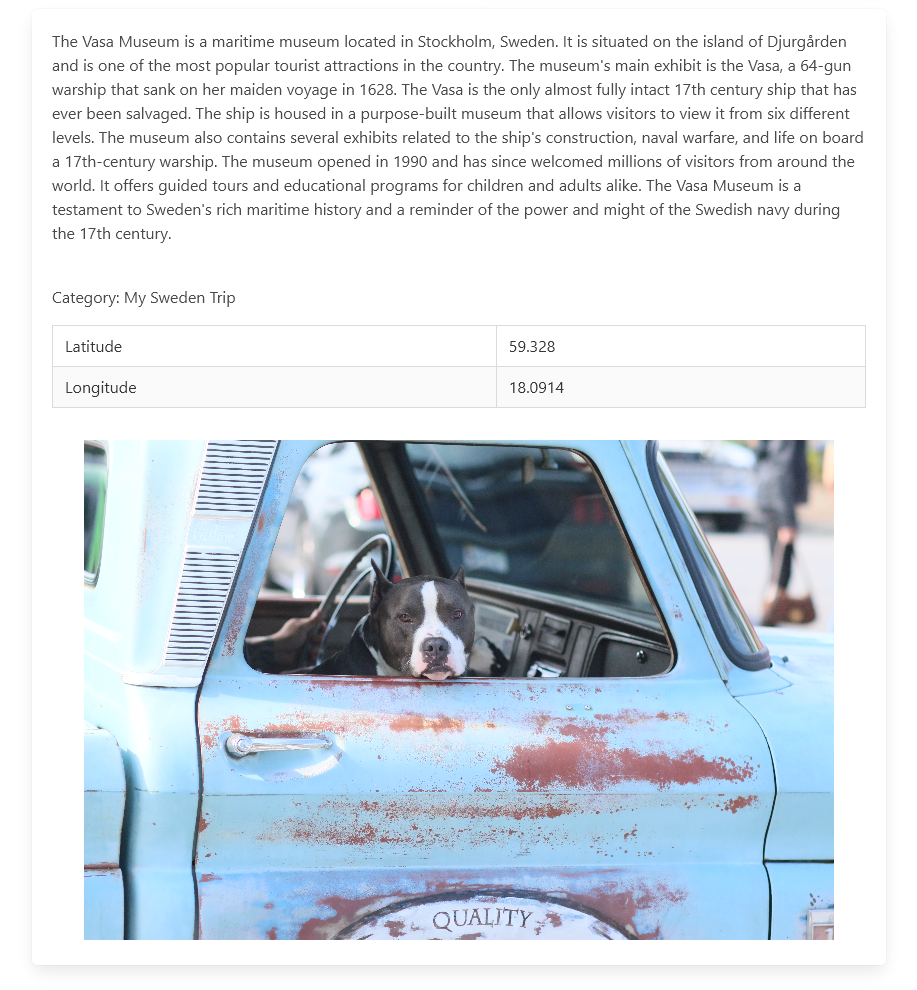

# Globe Lens

### Explore Your Journey Through Your Lens

Map Your Memories. Relive Your Adventures. Inspire New Ones.

### Features
- Create placemarks on a map
- Add images and descriptions to placemarks
- View placemarks on a map
- Image Gallery
- (For Admins) Statistics

### Deployment
This project is deployed at [globelens](https://globelens.netlify.app/)

### Corresponding Backend
The backend for this project can be found at [globelens-backend](https://github.com/RobinJahn/placemark_backend)

### Project Setup

- Clone the repository
- Install dependencies with `npm install`
- Add a .env File with your Openweathermap API Key Named `VITE_OPENWEATHERMAP_KEY`
- Run the server with `npm start`